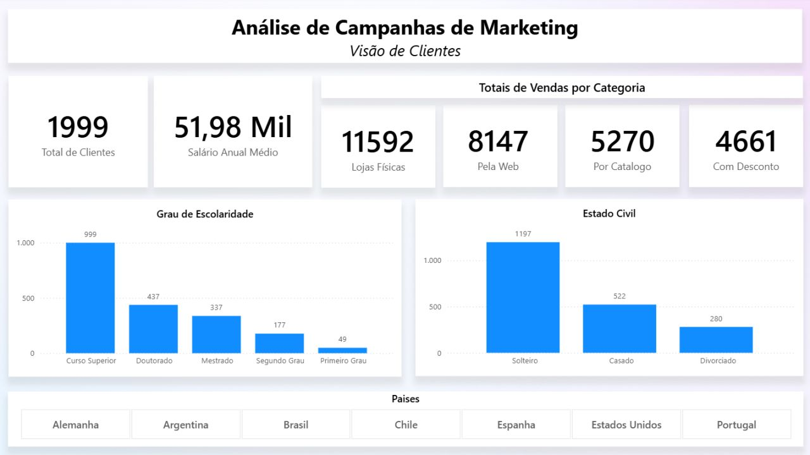
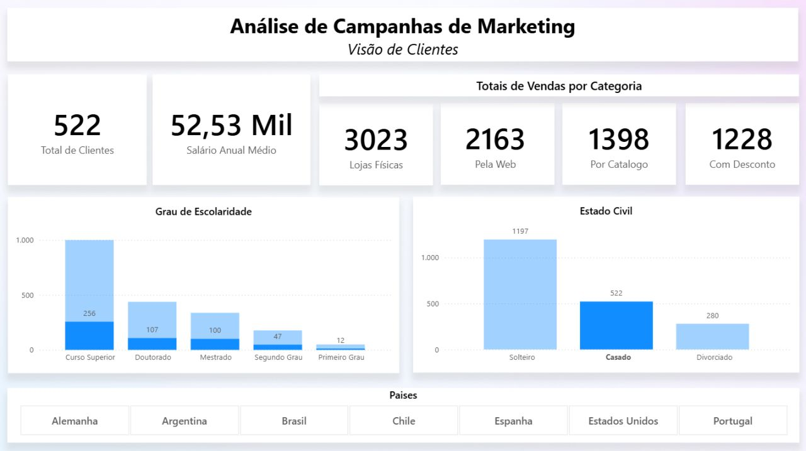
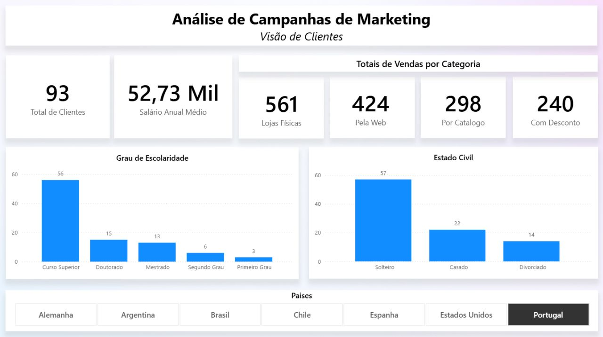
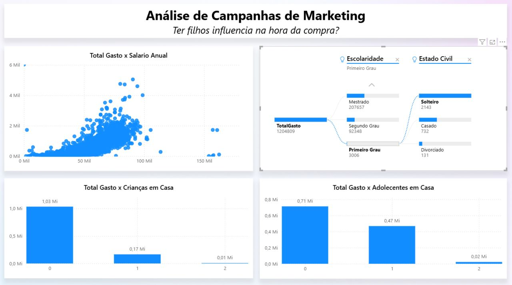
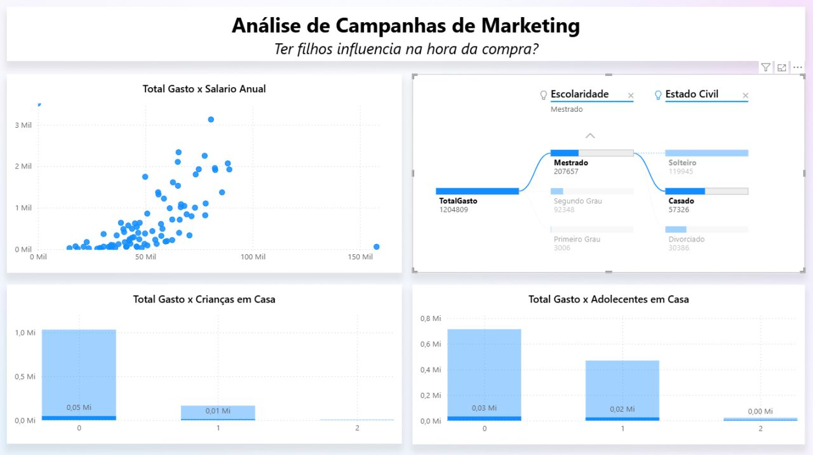
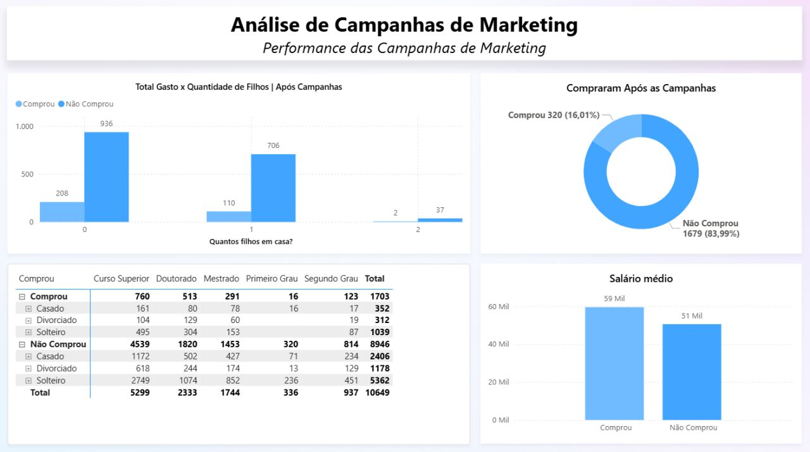
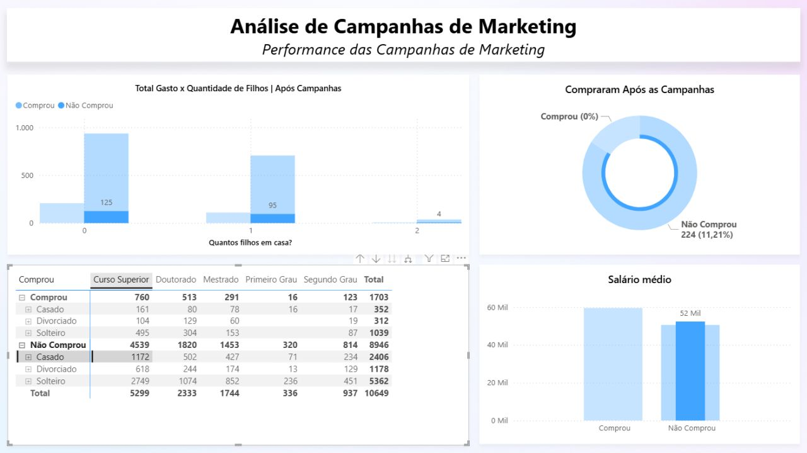
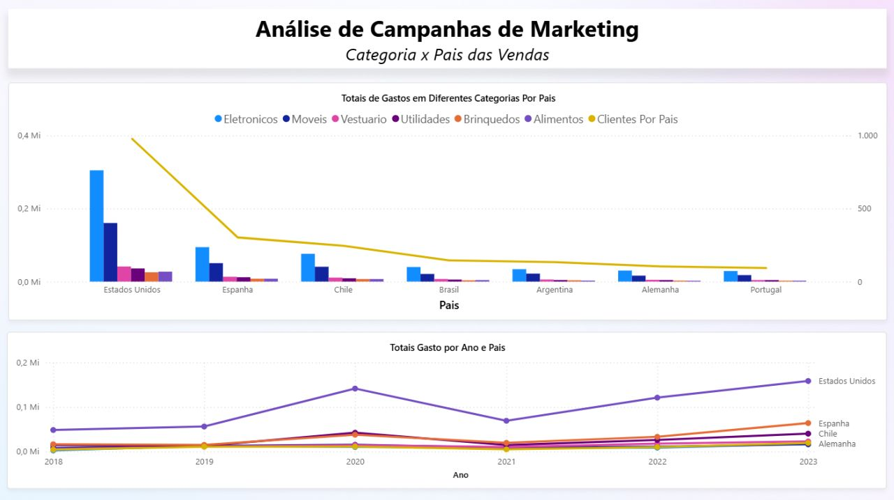
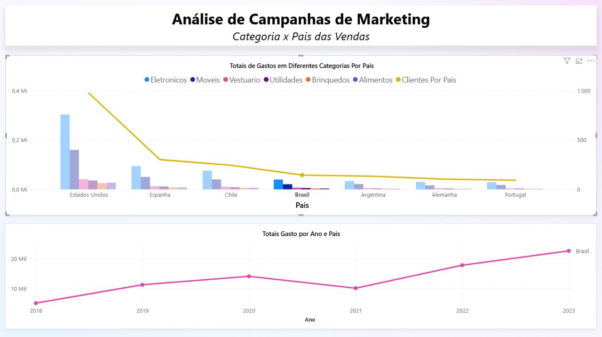

# 📊 Dashboard de Análise de Campanhas de Marketing
### Como dados podem melhorar campanhas de marketing?

---

## 📋 Sobre o Projeto

Dashboard interativo desenvolvido no Power BI para analisar o desempenho
de campanhas de marketing e entender o comportamento dos clientes a partir
de diferentes perspectivas.

O objetivo foi transformar dados de vendas e perfil de clientes em insights
que apoiem decisões estratégicas de negócio.

---

## 🔎 Principais Análises Realizadas

- Comparação de vendas por categoria e país
- Evolução dos gastos ao longo dos anos
- Perfil dos clientes (escolaridade, estado civil e renda média)
- Relação entre renda e comportamento de compra
- Impacto de filhos ou adolescentes no consumo
- Taxa de conversão das campanhas de marketing

---

## 📈 Insights Encontrados

- Clientes com maior renda tendem a apresentar maior volume de gasto
- A maior parte das compras ocorreu em lojas físicas, seguida por vendas online
- A taxa de conversão das campanhas foi de aproximadamente **16%**,
  indicando oportunidades para otimização das estratégias de marketing

---

## 🖼️ Dashboards

*(imagens serão adicionadas na próxima etapa)*

---

## 🛠️ Ferramentas Utilizadas

- Power BI
- Modelagem de Dados
- DAX
- Power Query
- SQL
- Data Visualization
- Storytelling com Dados

---

## 👨‍💻 Autor

Desenvolvido por **Davy Valmorbida**

[LinkedIn](https://linkedin.com/in/davyvalmorbida) •
[GitHub](https://github.com/davyweslley)
